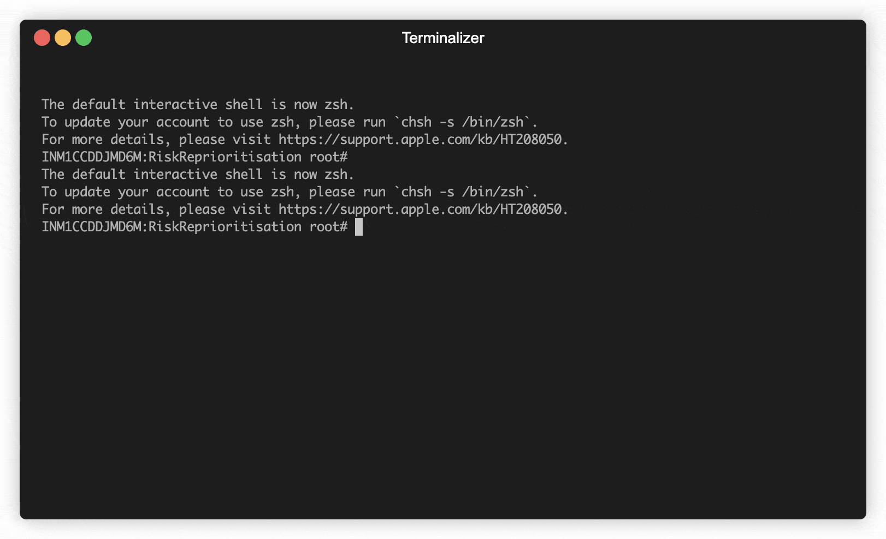

# Risklogyx 

  
Risklogyx represents a robust solution that aids in the prioritization of vulnerability patching. It achieves this by amalgamating CVSS, EPSS, and CISA's Known Exploited Vulnerabilities data. This tool delivers invaluable insights into the probability of exploitation and the potential repercussions of vulnerabilities on your information system.

## Installation

1. Clone the repository
2. Run the command - `pip3 install -r requirements.txt`
3. Request an API key from NIST NVD to avoid public rate limits. You can obtain a key here and add it to the env variable "NIST_API_KEY"
   
## Usage

To use this tool effectively, follow these steps:

1. Request an API key from NIST NVD to avoid public rate limits. You can obtain a key 
[here](https://nvd.nist.gov/developers/request-an-api-key) and add it to the env variable. Refer [this](https://www3.ntu.edu.sg/home/ehchua/programming/howto/Environment_Variables.html) to understand the procedure to set env variable based on your OS. 

2. Choose one of the following input methods:
   - **Single CVE:** Use the `-c` or `--cve` flags followed by the CVE ID.
   - **List of CVEs:** Provide a **space-separated** list of CVEs using the `-l` flag.
   - **File with CVEs:** Import a file containing CVE IDs (one per line) using the `-f` flag.
3. Tailor the output according to your needs:
   - Use the `-v` or `--verbose` flags for detailed information, including EPSS Score, CVSS Base Score, CVSS Version, 
   CVSS Severity, and CISA KEV status.
   - Define custom thresholds using the `--cvss` and/or `--epss` flags to align the results with your organization's 
   risk appetite.

## Installation

1. Clone the repository
2. Run the command - `pip3 install -r requirements.txt`
3. Request an API key from NIST NVD to avoid public rate limits. You can obtain a key here and add it to the env variable "NIST_API_KEY"
   
## Usage

To use this tool effectively, follow these steps:

1. Request an API key from NIST NVD to avoid public rate limits. You can obtain a key 
[here](https://nvd.nist.gov/developers/request-an-api-key) and add it to the env variable

2. Choose one of the following input methods:
   - **Single CVE:** Use the `-c` or `--cve` flags followed by the CVE ID.
   - **List of CVEs:** Provide a **space-separated** list of CVEs using the `-l` flag.
   - **File with CVEs:** Import a file containing CVE IDs (one per line) using the `-f` flag.
3. Tailor the output according to your needs:
   - Use the `-v` or `--verbose` flags for detailed information, including EPSS Score, CVSS Base Score, CVSS Version, 
   CVSS Severity, and CISA KEV status.
   - Define custom thresholds using the `--cvss` and/or `--epss` flags to align the results with your organization's 
   risk appetite.

### Examples

#### Single CVE

`python3 main.py -c CVE-2020-29127`

#### List of CVEs

`python3 main.py -l CVE-2020-29127 CVE-2017-16885`

#### File with CVEs

`python3 main.py -f file.txt`

### Outputs

Here are the available output options:

**Summary Results (default):** Provides a concise summary, including the CVE-ID and its priority.

**Verbose Mode:** Enables detailed output with the following information for each CVE:

- EPSS Score
- CVSS Score
- INFA Severity
- CISA KEV Status (TRUE or FALSE)

### Supported OS 

 

